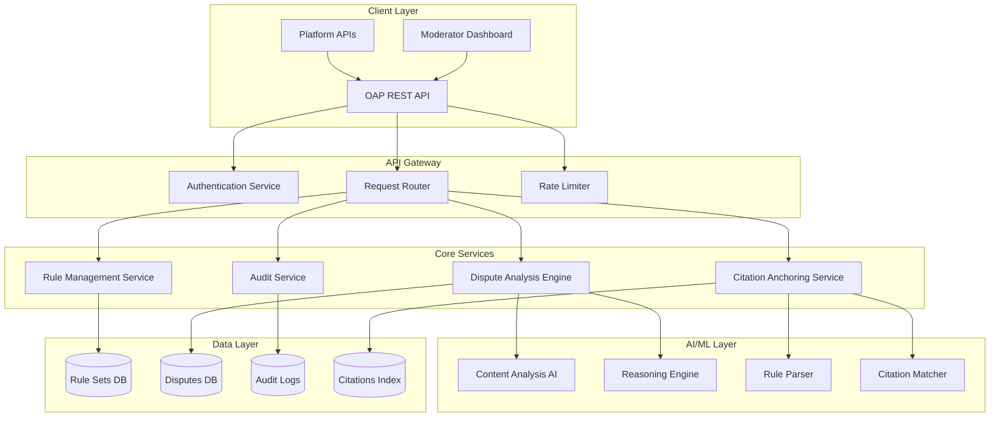

# Design Document: Open Adjudication Protocol

## Overview

The Open Adjudication Protocol (OAP) is a B2B Trust & Safety Infrastructure that provides transparent, AI-assisted reasoning for online disputes and moderation events. The system serves as an API-first, doctrine-driven reasoning layer that makes conflicts intelligible and auditable without issuing verdicts or enforcing penalties.

The core innovation is **Citation Anchoring** - a mechanism that ensures every evaluative statement is linked to specific rule clauses, preventing AI hallucination and providing legally defensible reasoning. This addresses the critical need for DSA-compliant "Statement of Reasons" documentation while maintaining transparency and human oversight.

## Architecture

### High-Level Architecture



### Service Architecture Principles

1. **API-First Design**: All functionality exposed through well-documented REST APIs
2. **Microservices Pattern**: Loosely coupled services with clear boundaries
3. **Event-Driven Architecture**: Asynchronous processing for complex analysis workflows
4. **Multi-Tenant Isolation**: Complete data and configuration separation between clients
5. **Immutable Audit Trail**: All decisions and reasoning steps permanently logged

## Components and Interfaces

### 1. Dispute Analysis Engine

**Purpose**: Core service that processes dispute contexts and generates reasoned analysis.

**Key Interfaces**:

```json
POST /api/v1/disputes/analyze
{
  "dispute_id": "string",
  "tenant_id": "string",
  "content": {
    "type": "text|image|video|audio",
    "data": "string|base64",
    "metadata": {
      "author_id": "string",
      "timestamp": "ISO8601",
      "platform_context": "object"
    }
  },
  "rule_set_id": "string",
  "reporter_context": {
    "reporter_id": "string",
    "report_reason": "string",
    "additional_evidence": "array"
  }
}
```

**Response Schema**:

```json
{
  "analysis_id": "string",
  "dispute_id": "string",
  "status": "completed|processing|failed",
  "reasoning": {
    "summary": "string",
    "findings": [
      {
        "finding_id": "string",
        "statement": "string",
        "citations": [
          {
            "rule_clause_id": "string",
            "rule_text": "string",
            "relevance_score": "number",
            "anchor_type": "exact_match|semantic_match|contextual"
          }
        ],
        "confidence": "number",
        "evidence_references": ["string"]
      }
    ],
    "alternative_interpretations": [
      {
        "interpretation": "string",
        "supporting_citations": ["object"],
        "likelihood": "number"
      }
    ],
    "uncertainty_areas": ["string"]
  },
  "dsa_compliance": {
    "statement_of_reasons": "string",
    "legal_grounds": ["string"],
    "territorial_scope": "string",
    "redress_options": ["string"]
  },
  "processing_metadata": {
    "analysis_duration_ms": "number",
    "ai_models_used": ["string"],
    "human_review_required": "boolean",
    "created_at": "ISO8601"
  }
}
```

### 2. Citation Anchoring Service

**Purpose**: Ensures every evaluative statement is linked to specific rule clauses.

**Core Functions**:
- Parse and index rule sets for efficient citation matching
- Validate that all reasoning statements have proper citations
- Maintain bidirectional traceability between statements and rules
- Flag unsupported statements that cannot be anchored

**Key Interfaces**:

```json
POST /api/v1/citations/anchor
{
  "statement": "string",
  "rule_set_id": "string",
  "context": "object",
  "anchor_requirements": {
    "min_confidence": "number",
    "allow_semantic_matching": "boolean",
    "require_exact_quotes": "boolean"
  }
}
```

### 3. Rule Management Service

**Purpose**: Handles ingestion, parsing, and management of client rule sets.

**Supported Formats**:
- Plain text community guidelines
- Structured JSON policy documents
- HTML terms of service
- Markdown documentation

**Processing Pipeline**:
1. **Ingestion**: Accept rule documents in various formats
2. **Normalization**: Convert to standardized internal format
3. **Clause Extraction**: Identify discrete rule clauses
4. **Indexing**: Create searchable citation index
5. **Validation**: Ensure completeness and consistency
6. **Versioning**: Maintain historical versions

**Key Interfaces**:

```json
POST /api/v1/rules/ingest
{
  "tenant_id": "string",
  "rule_set_name": "string",
  "format": "text|json|html|markdown",
  "content": "string",
  "metadata": {
    "version": "string",
    "effective_date": "ISO8601",
    "jurisdiction": "string"
  }
}
```

### 4. Moderator Review Interface

**Purpose**: Provides human oversight and review capabilities.

**Features**:
- Review AI-generated reasoning
- Add human annotations and alternative interpretations
- Override or supplement AI findings
- Track moderator decisions for system improvement

**Key Interfaces**:

```json
POST /api/v1/moderation/review
{
  "analysis_id": "string",
  "moderator_id": "string",
  "review": {
    "agreement_level": "agree|partial|disagree",
    "annotations": [
      {
        "finding_id": "string",
        "comment": "string",
        "alternative_reasoning": "string"
      }
    ],
    "final_decision": {
      "action": "string",
      "reasoning": "string",
      "additional_citations": ["object"]
    }
  }
}
```

### 5. Audit Service

**Purpose**: Maintains comprehensive audit trails and compliance reporting.

**Audit Data Captured**:
- All API requests and responses
- AI model decisions and confidence scores
- Human moderator actions and reasoning
- Rule set changes and versioning
- System performance metrics

**Key Interfaces**:

```json
GET /api/v1/audit/export
{
  "tenant_id": "string",
  "date_range": {
    "start": "ISO8601",
    "end": "ISO8601"
  },
  "format": "json|csv|xml",
  "compliance_standard": "dsa|gdpr|custom"
}
```

## Data Models

### Core Data Structures

**Dispute Context**:
```json
{
  "dispute_id": "uuid",
  "tenant_id": "uuid",
  "content": {
    "type": "enum",
    "data": "string|binary",
    "hash": "sha256",
    "metadata": "object"
  },
  "participants": {
    "author": "user_object",
    "reporter": "user_object",
    "moderators": ["user_object"]
  },
  "timeline": [
    {
      "event": "string",
      "timestamp": "datetime",
      "actor": "string"
    }
  ],
  "status": "enum",
  "created_at": "datetime",
  "updated_at": "datetime"
}
```

**Rule Set**:
```json
{
  "rule_set_id": "uuid",
  "tenant_id": "uuid",
  "name": "string",
  "version": "semver",
  "clauses": [
    {
      "clause_id": "uuid",
      "text": "string",
      "category": "string",
      "severity": "enum",
      "keywords": ["string"],
      "semantic_embedding": "vector"
    }
  ],
  "metadata": {
    "jurisdiction": "string",
    "effective_date": "datetime",
    "language": "string"
  },
  "status": "active|deprecated|draft",
  "created_at": "datetime"
}
```

**Citation**:
```json
{
  "citation_id": "uuid",
  "statement": "string",
  "rule_clause_id": "uuid",
  "anchor_type": "exact|semantic|contextual",
  "confidence_score": "float",
  "context": "object",
  "validation_status": "verified|pending|invalid",
  "created_at": "datetime"
}
```

### Database Schema Design

**Multi-Tenant Data Isolation**:
- All tables include `tenant_id` for row-level security
- Separate database schemas per tenant for sensitive data
- Encrypted storage for rule sets and dispute content
- Audit logs with immutable append-only structure

**Performance Considerations**:
- Indexed citation matching for sub-second response times
- Cached rule embeddings for semantic search
- Partitioned audit tables by date for efficient queries
- Read replicas for analytics and reporting workloads

## Correctness Properties

*A property is a characteristic or behavior that should hold true across all valid executions of a system—essentially, a formal statement about what the system should do. Properties serve as the bridge between human-readable specifications and machine-verifiable correctness guarantees.*

### Property 1: Citation Anchoring Completeness
*For any* dispute analysis generated by the system, every evaluative statement must be linked to at least one specific rule clause, and any statement that cannot be anchored must be explicitly flagged as unsupported.
**Validates: Requirements 2.1, 2.3**

### Property 2: Citation Text Accuracy  
*For any* citation generated by the system, the cited rule text must exactly match the text in the corresponding rule clause within the active rule set.
**Validates: Requirements 2.2**

### Property 3: Bidirectional Citation Traceability
*For any* citation relationship in the system, if statement S cites rule clause R, then rule clause R must be traceable back to statement S, maintaining consistent bidirectional links.
**Validates: Requirements 2.4**

### Property 4: Rule Ingestion Determinism
*For any* rule document uploaded to the system, parsing the same document multiple times must produce identical clause structures with consistent unique identifiers.
**Validates: Requirements 3.1, 3.3**

### Property 5: Multi-Format Rule Equivalence
*For any* rule set content, ingesting it in different supported formats (text, JSON, HTML, markdown) must produce semantically equivalent internal representations with the same citation capabilities.
**Validates: Requirements 3.2**

### Property 6: Rule Versioning Preservation
*For any* rule set modification, the system must create a new version while preserving all historical versions, and existing citations must remain valid or be explicitly marked as broken.
**Validates: Requirements 3.5, 2.5**

### Property 7: Analysis Structure Consistency
*For any* dispute context submitted to the API, the returned analysis must conform to the documented JSON schema with all required fields present and properly typed.
**Validates: Requirements 1.3**

### Property 8: Evidence Completeness
*For any* dispute analysis, all evidence provided in the input context must either be referenced in the reasoning or explicitly noted as irrelevant or insufficient.
**Validates: Requirements 1.2**

### Property 9: Findings Organization
*For any* analysis output containing multiple findings, the findings must be ordered by relevance and strength according to defined scoring criteria.
**Validates: Requirements 4.2**

### Property 10: Uncertainty Detection
*For any* dispute analysis where conflicting evidence exists, the system must identify and highlight these conflicts in the uncertainty areas section.
**Validates: Requirements 4.3, 6.2**

### Property 11: Evidence-Based Reasoning
*For any* conclusion in a dispute analysis, there must be at least one explicit reference to evidence from the dispute context that supports that conclusion.
**Validates: Requirements 6.4**

### Property 12: API Compliance
*For any* API endpoint in the system, it must follow REST conventions with appropriate HTTP methods, status codes, and JSON request/response formats that conform to documented schemas.
**Validates: Requirements 7.1, 7.2**

### Property 13: Error Response Quality
*For any* malformed API request, the system must return an appropriate HTTP error status code with a descriptive error message that identifies the specific validation failure.
**Validates: Requirements 7.3**

### Property 14: Authentication Enforcement
*For any* API request without valid authentication credentials, the system must reject the request with a 401 or 403 status code and not process any part of the request.
**Validates: Requirements 7.4**

### Property 15: Audit Trail Completeness
*For any* system operation (API request, analysis generation, moderator action), there must be a corresponding immutable audit log entry with complete metadata.
**Validates: Requirements 8.1**

### Property 16: DSA Compliance Output
*For any* dispute analysis that results in a content moderation decision, the system must generate a Statement of Reasons that includes all required DSA Article 17 elements.
**Validates: Requirements 8.2**

### Property 17: Multi-Tenant Data Isolation
*For any* tenant operation, the system must only access data and configurations belonging to that tenant, with no cross-tenant data leakage.
**Validates: Requirements 9.1, 9.3**

### Property 18: Moderator Annotation Persistence
*For any* moderator annotation or alternative reasoning added to an analysis, the input must be permanently stored and retrievable with proper attribution to the moderator.
**Validates: Requirements 5.2, 5.3**

### Property 19: Processing Log Completeness
*For any* dispute submitted for analysis, there must be a complete processing log that tracks all analysis steps and their outcomes.
**Validates: Requirements 1.5**

### Property 20: Performance Metrics Collection
*For any* system operation, relevant performance metrics (response time, resource usage, success/failure status) must be captured and made available for monitoring.
**Validates: Requirements 10.5**

## Error Handling

### Error Classification

**Input Validation Errors**:
- Malformed JSON requests
- Missing required fields
- Invalid data types or formats
- Rule set parsing failures

**Business Logic Errors**:
- Citation anchoring failures
- Rule set validation failures
- Insufficient evidence for analysis
- Conflicting rule interpretations

**System Errors**:
- Database connectivity issues
- AI model service failures
- Authentication service outages
- Resource exhaustion conditions

### Error Response Strategy

**Structured Error Responses**:
```json
{
  "error": {
    "code": "string",
    "message": "string",
    "details": "object",
    "timestamp": "ISO8601",
    "request_id": "uuid"
  }
}
```

**Graceful Degradation**:
- Partial analysis when some evidence is unavailable
- Human escalation when AI confidence is too low
- Cached responses during service outages
- Queue-based retry mechanisms for transient failures

**Error Recovery Patterns**:
- Automatic retry with exponential backoff
- Circuit breaker pattern for external dependencies
- Fallback to simpler analysis methods
- Human-in-the-loop escalation for complex cases

## Testing Strategy

### Dual Testing Approach

The system requires both unit testing and property-based testing to ensure comprehensive coverage:

**Unit Tests** focus on:
- Specific examples of rule parsing and citation matching
- Edge cases in dispute analysis (empty content, malformed rules)
- Error conditions and exception handling
- Integration points between services
- DSA compliance output format validation

**Property Tests** focus on:
- Universal properties that hold across all inputs
- Comprehensive input coverage through randomization
- Citation anchoring correctness across diverse rule sets
- Multi-tenant isolation across various tenant configurations
- API compliance across different request patterns

### Property-Based Testing Configuration

**Testing Framework**: Use Hypothesis (Python), fast-check (TypeScript), or QuickCheck (Haskell) depending on implementation language choice.

**Test Configuration**:
- Minimum 100 iterations per property test
- Each property test must reference its design document property
- Tag format: **Feature: open-adjudication-protocol, Property {number}: {property_text}**

**Test Data Generation**:
- Random dispute contexts with varying content types and metadata
- Generated rule sets with different structures and complexities  
- Synthetic moderator inputs and annotations
- Multi-tenant scenarios with isolated data sets

### Critical Test Scenarios

**Citation Anchoring Tests**:
- Verify every evaluative statement has valid citations
- Test citation accuracy against rule text
- Validate unsupported statement flagging
- Check bidirectional traceability maintenance

**Multi-Tenant Isolation Tests**:
- Ensure complete data segregation between tenants
- Verify configuration isolation
- Test cross-tenant access prevention
- Validate tenant-specific analytics

**DSA Compliance Tests**:
- Verify Statement of Reasons completeness
- Test legal grounds identification
- Validate territorial scope handling
- Check redress option inclusion

**Performance and Scalability Tests**:
- Load testing for concurrent dispute processing
- Response time validation under various loads
- Resource usage monitoring and alerting
- Auto-scaling behavior verification